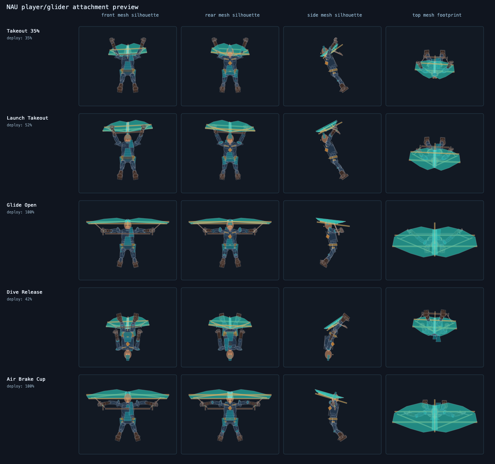
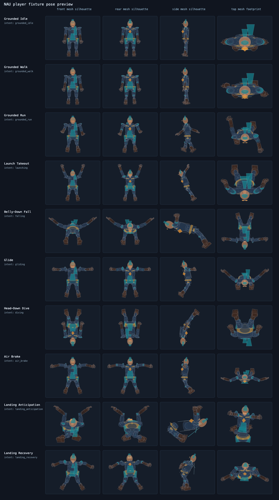
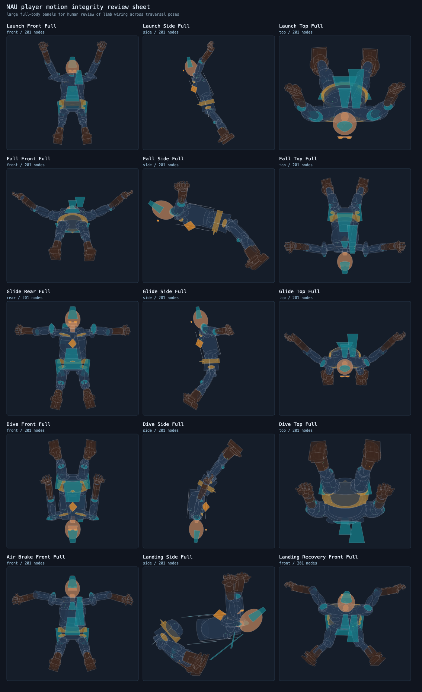
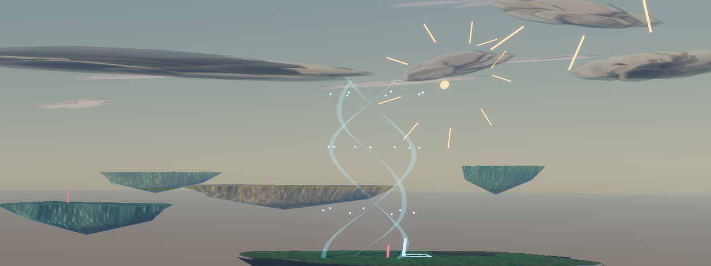

# NAU Engine

Mac-first Rust/Bevy flight sandbox for tuning traversal feel before growing into a broader engine.

The current focus is narrow: make glide, dive, lift, camera framing, authored player motion, and route readability measurable enough that changes can be reviewed by eye and by eval output.

<p align="center">
  
</p>

## What Exists

- A small third-person flight playground with launch, glide, dive, air-brake, landing anticipation, and landing recovery states.
- A self-authored player/glider fixture with pose-intent animation, connector checks, silhouette review, and visual pose sheets.
- Floating-island traversal routes with generated terrain, water, clouds, route markers, updraft ribbons, crosswind cues, and debug overlays.
- Scripted evals for movement, camera stability, route progress, collision, fixture readiness, visual readability, and screenshot audits.

## Visual Review

These are checked-in copies of generated eval artifacts. The source outputs live under `target/eval/` after running the relevant preview or screenshot scripts.

<p align="center">
  
  
</p>

<p align="center">
  
</p>

## Run

Install Rust with `rustup`, then:

```sh
cargo run
```

Repo-local alias:

```sh
cargo naux
```

## Useful Checks

```sh
cargo check
cargo fmt --check
cargo test
cargo clippy --all-targets --all-features -- -D warnings
```

Visual and fixture artifacts:

```sh
./tools/player_pose_preview.sh target/player_pose_preview
NAU_EVAL_SCREENSHOT=1 ./tools/eval.sh long_glide_visibility target/eval/long_glide_visibility
NAU_EVAL_SCREENSHOT=1 ./tools/eval.sh updraft_route target/eval/updraft_route
./tools/eval_sim_suite.sh target/eval/sim_suite
./tools/terrain_export.sh target/terrain_export
./tools/visual_content_export.sh target/visual_content_export
```

## Controls

|Input|Action|
|-|-|
|`W` / `S`|Accelerate forward/back|
|`A` / `D`|Strafe/steer|
|Mouse|Look while locked or while right mouse is held|
|Left click|Lock and hide the mouse cursor|
|Esc|Release the mouse cursor|
|`Space`|Deploy glider while airborne|
|`E`|Launch upward from the ground|
|`Shift`|Dive|
|`F1`|Toggle debug gizmos|

## Docs

- [Architecture](docs/ARCHITECTURE.md)
- [Eval Spec](docs/EVAL_SPEC.md)
- [Flight Mechanics](docs/MECHANICS/flight.md)
- [Roadmap](docs/ROADMAP.md)

## Principles

- Keep the playable loop small and measurable.
- Add debug visualization before complex behavior.
- Prefer Bevy-native systems until a measured limitation appears.
- Keep traversal constants visible and easy to tune.
- Avoid raw Metal unless profiling proves it is needed behind a clear boundary.
