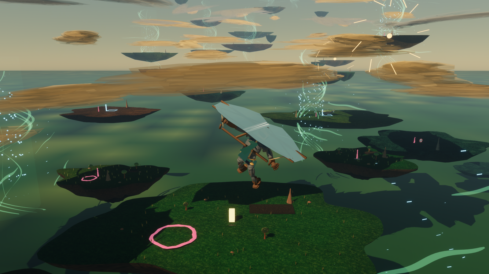
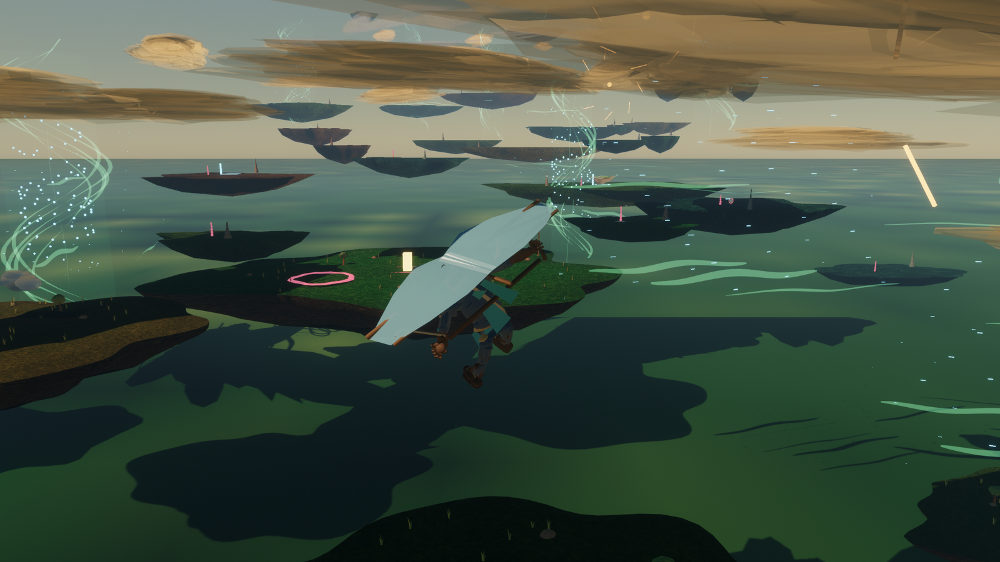
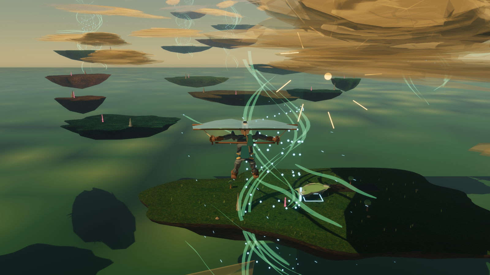
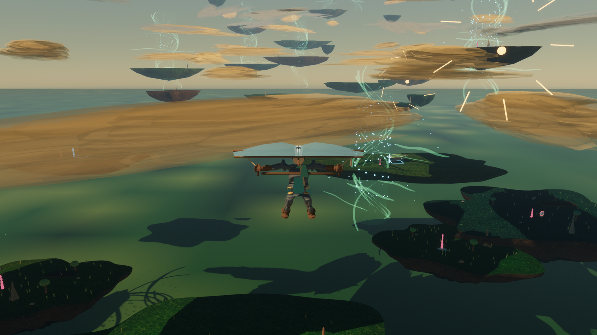
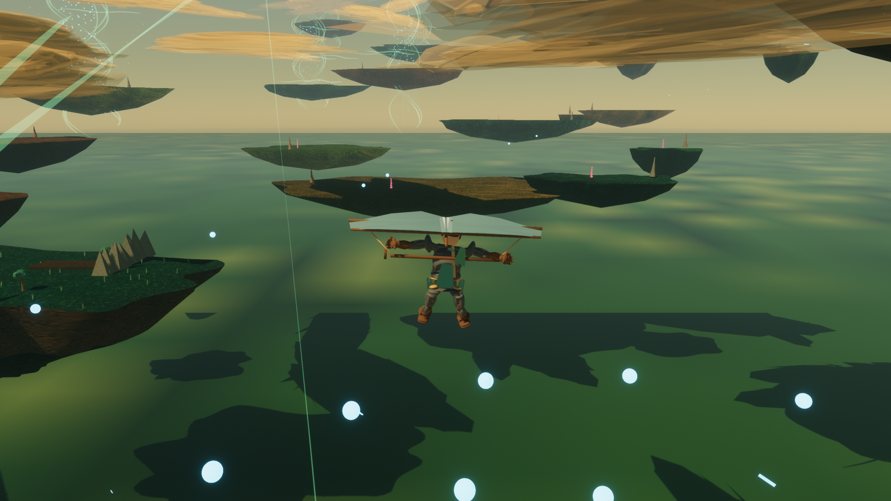
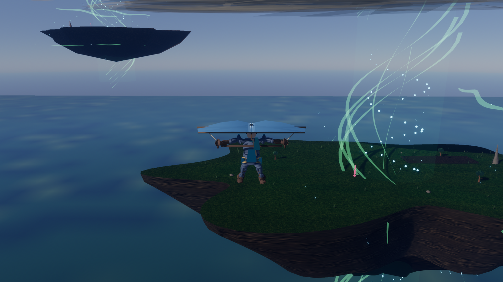

# NAU Engine Showcase

Visual snapshots from the current Rust/Bevy traversal sandbox: clean eval screenshots, generated character rig review sheets, and export metrics from the content pipeline.

## Route Captures

<p align="center">
  
</p>

<p align="center">
  
  
</p>

<p align="center">
  
</p>

<p align="center">
  
  
</p>

<p align="center">
  
  
</p>

<p align="center">
  
  
</p>

## Player And Glider Review

<p align="center">
  
  
</p>

<p align="center">
  
</p>

## Generated Content

- Terrain export: 41 islands, 164 meshes, 167,444 vertices, 318,816 triangles.
- Visual content export: 568 meshes, 537,821 vertices, 554,270 triangles.
- Wind visual export: 38 fields, 3,338 visuals, 417,852 sampled tracks.

## Reproduce

```sh
./tools/player_pose_preview.sh target/player_pose_preview
NAU_EVAL_SCREENSHOT=1 ./tools/eval.sh island_launch_to_landing target/eval/island_launch_to_landing
NAU_EVAL_SCREENSHOT=1 ./tools/eval.sh branch_recovery_route target/eval/branch_recovery_route
NAU_EVAL_SCREENSHOT=1 ./tools/eval.sh updraft_route target/eval/updraft_route
NAU_EVAL_SCREENSHOT=1 ./tools/eval.sh long_glide_visibility target/eval/long_glide_visibility
NAU_EVAL_SCREENSHOT=1 ./tools/eval.sh great_sky_plateau_route target/eval/great_sky_plateau_route
./tools/terrain_export.sh target/terrain_export
./tools/visual_content_export.sh target/visual_content_export
./tools/wind_visual_export.sh target/wind_visual_export
```
