# NAU Engine Showcase

Current gameplay captures and generated review artifacts from the playable Rust/Bevy traversal baseline.

## Current Gameplay

<p align="center">
  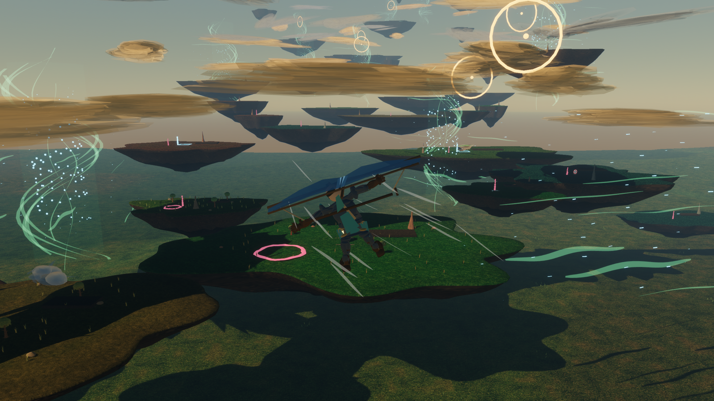
</p>

<p align="center">
  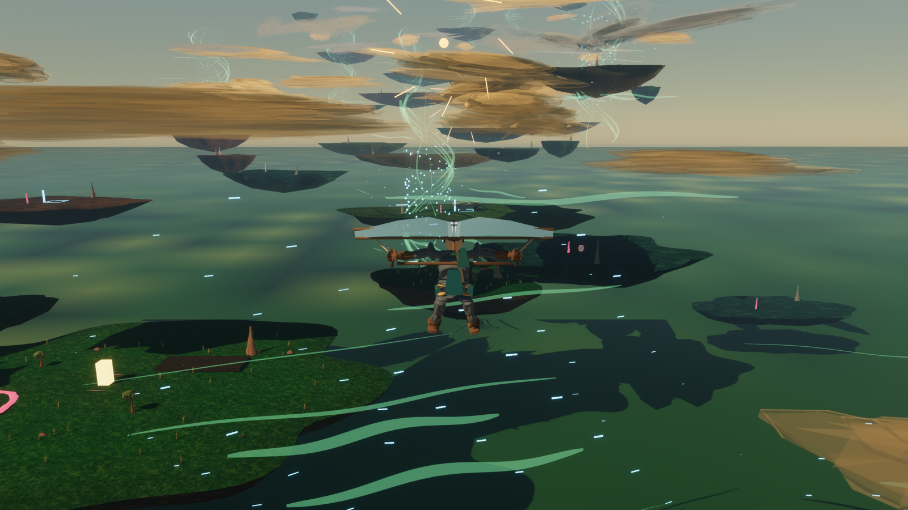
  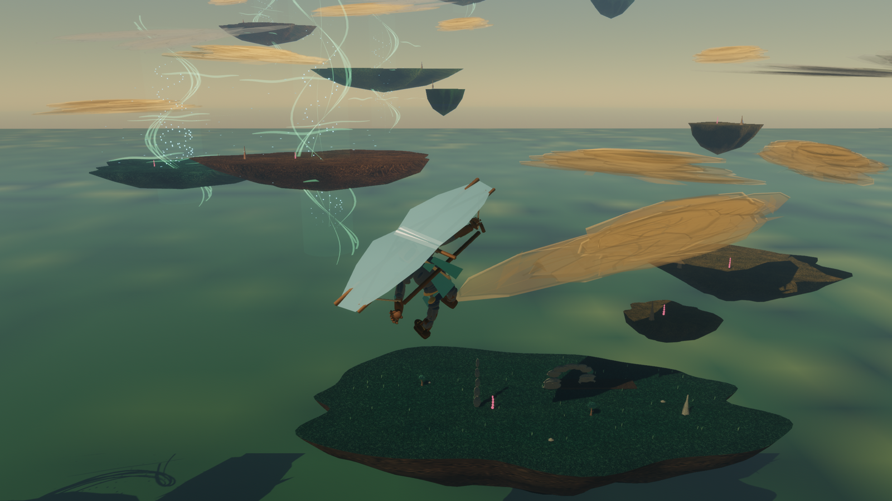
</p>

<p align="center">
  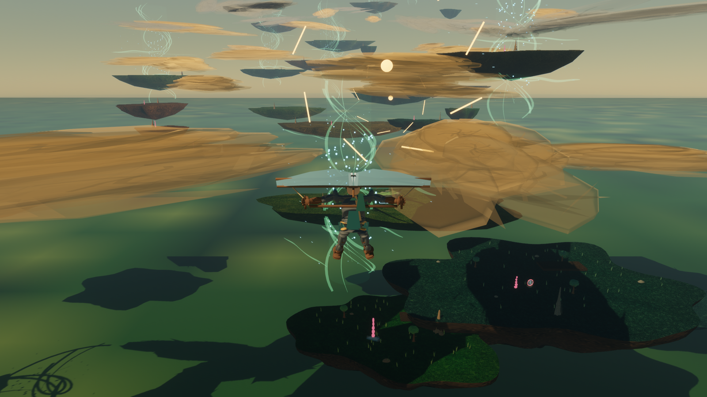
  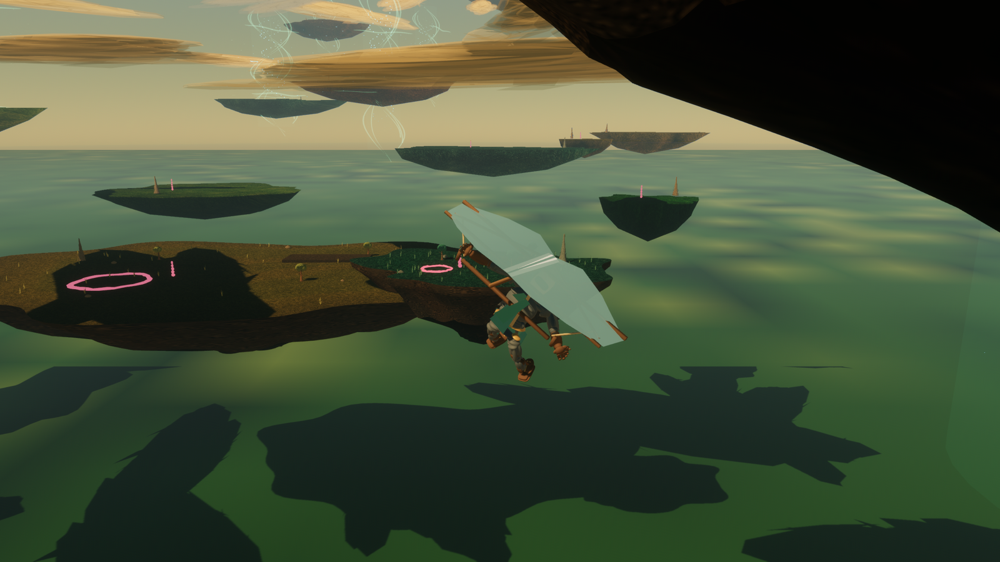
</p>

The playable loop covers launch, glider deployment, steering, diving, air braking, authored lift and crosswind use, gate collection, landing, recovery, and relaunch. The current route contains 18 lift fields and 20 crosswind fields; ordinary gliding does not create altitude by itself.

## World-Floor Scale

<p align="center">
  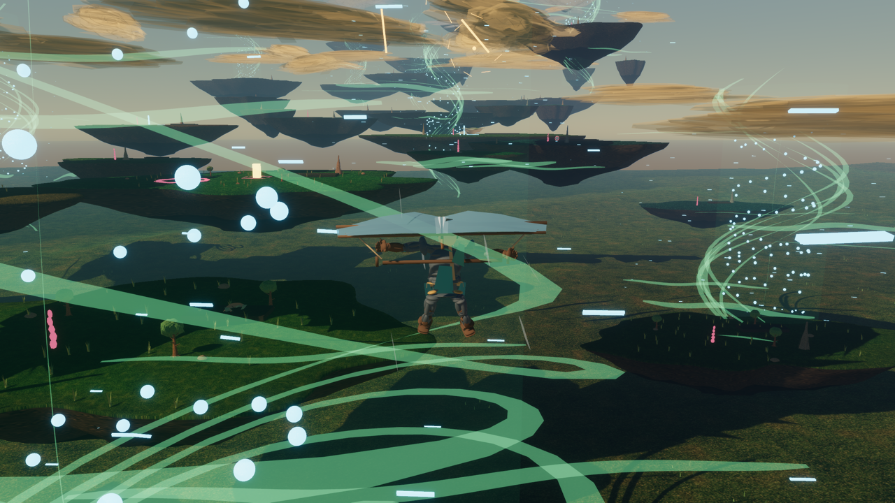
  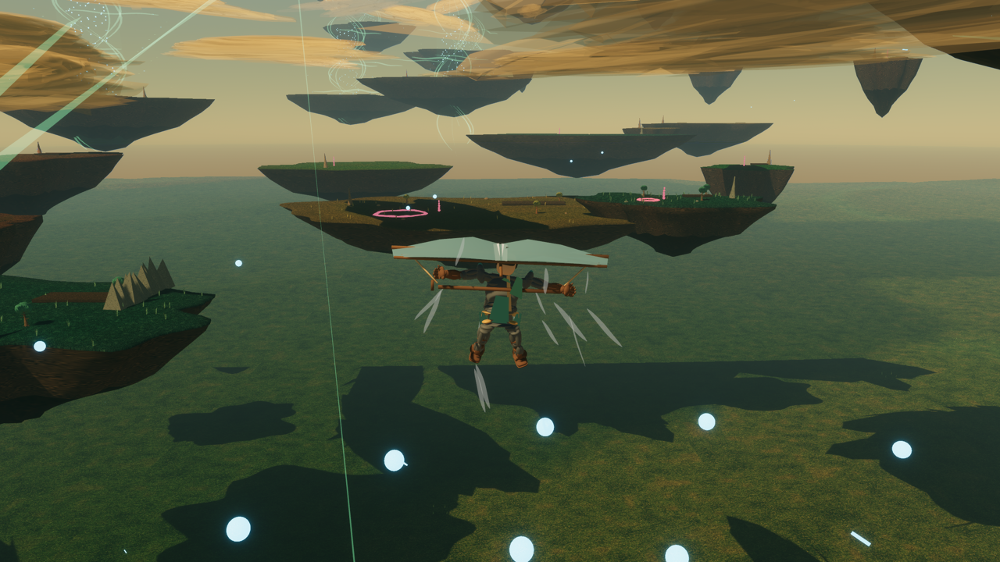
</p>

The route spans 41 floating islands across 20 terrain archetypes above a streamed, landable world floor. The floor keeps a player-centered `3x3` visible window from a pool capped at 25 tiles and supports grounded traversal and relaunch.

## UI And Objectives

<p align="center">
  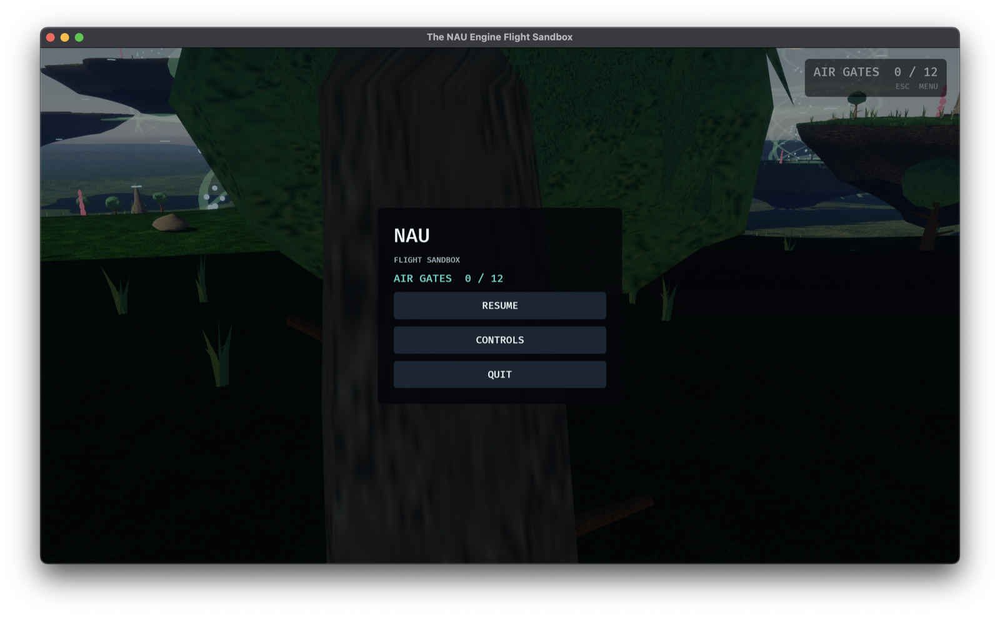
</p>

Twelve one-shot air gates cover the three-gate main corridor and nine optional low, thermal, and high-altitude branch targets. The HUD and pause menu share the authoritative collection total; the richer route-beat, lift-sequence, recovery, and landing-target data is not yet exposed as a complete player-facing progression.

## Player And Glider Review

<p align="center">
  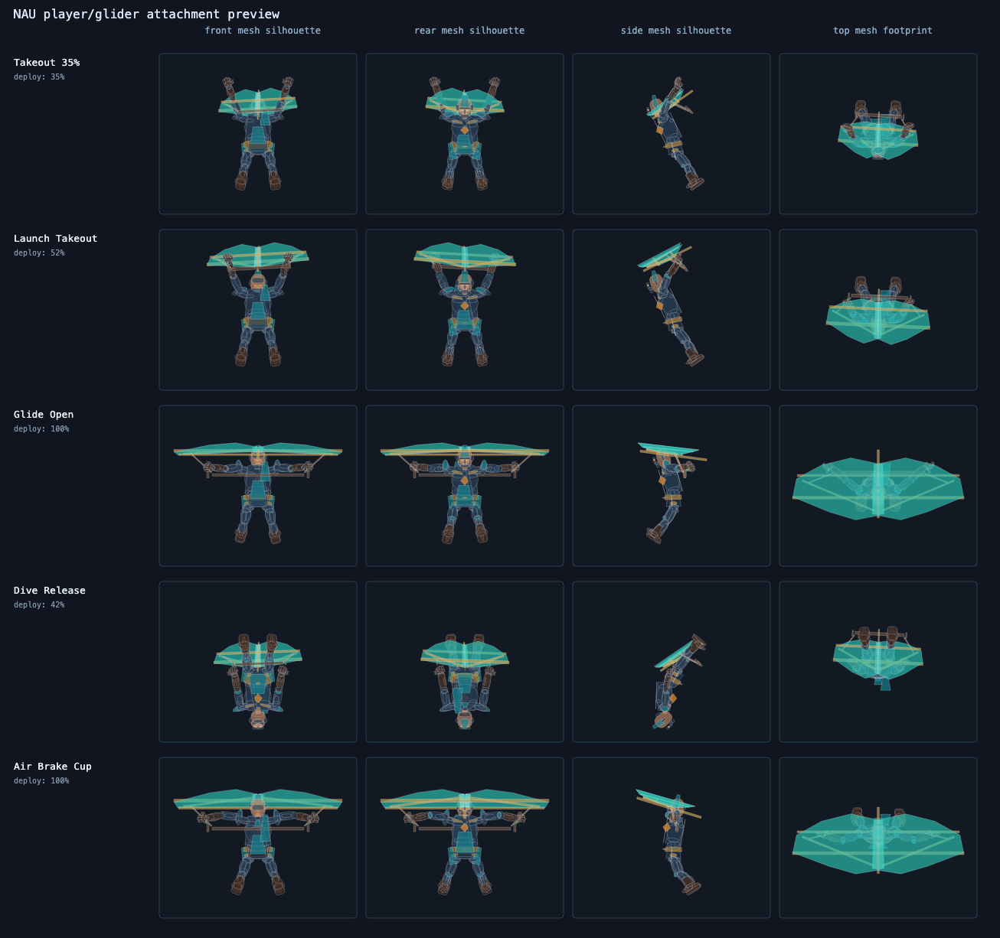
  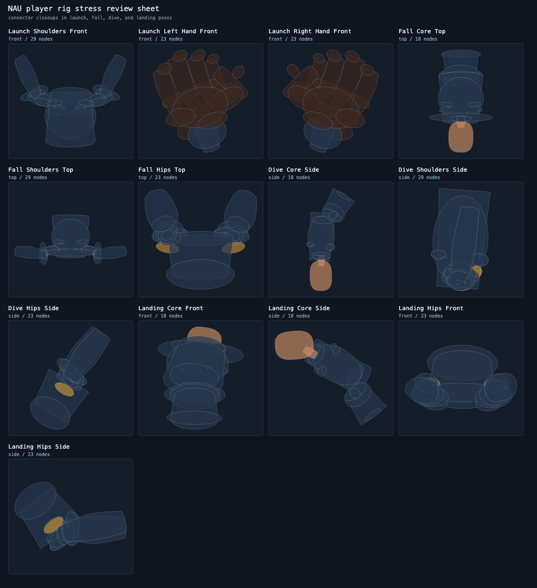
</p>

<p align="center">
  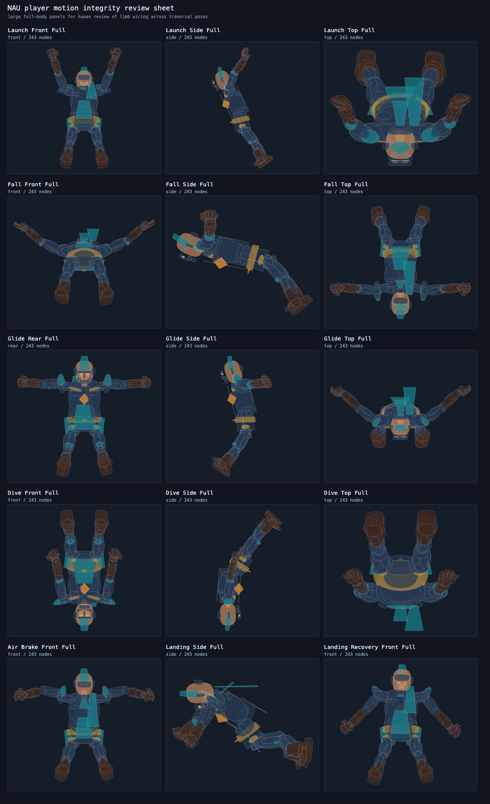
</p>

These generated sheets review authored attachment, silhouette, transition, and motion integrity across grounded movement, launch, glide, dive, air-brake, and landing states. The current self-authored glTF fixture is an approximate non-skeletal prototype, not a production character rig.

## Measured Content

- Terrain export: 41 islands, 164 meshes, 194,996 vertices, 366,048 triangles.
- Visual content export: 570 meshes, 538,211 vertices, 554,894 triangles.
- Wind visual export: 38 fields, 3,338 visuals, 417,852 sampled tracks.

These totals were regenerated from the current source on 2026-07-14. The checked-in images are selected outputs from the same eval, world-floor evidence, UI, and pose-preview pipelines.

## Reproduce

```sh
./tools/player_pose_preview.sh target/player_pose_preview
cargo run -- --eval updraft_route --eval-output target/eval/updraft_route
cargo run -- --eval long_glide_visibility --eval-output target/eval/long_glide_visibility
cargo run -- --eval great_sky_plateau_route --eval-output target/eval/great_sky_plateau_route
./tools/terrain_export.sh target/terrain_export
./tools/visual_content_export.sh target/visual_content_export
./tools/wind_visual_export.sh target/wind_visual_export
```
